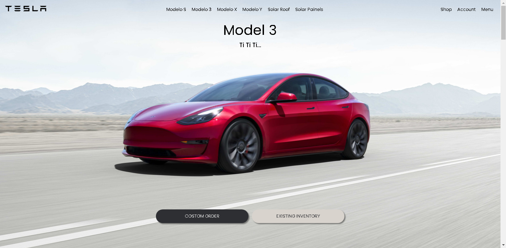

<h1 align="center">
  Tesla Site
</h1>

Esse é um projeto de clone do Site Tesla.com , que usas o ReactJs, scrollreveal, typescript,  
sass e react-router-dom, para ver mais <a href=''> Clique Aqui</a>

  

<h1 align="center">
  Requisitos para Instalar o projeto
</h1>

  1º: Node <a href='https://nodejs.org/en/'> Instalação </a>  

  2º: VScode <a href='https://code.visualstudio.com/download'> Instalação </a>  

  3º: Git <a href='https://git-scm.com/downloads'> Instalação </a>  

  

<h1 align="center">
  Requisitos para Rodar o projeto
</h1>

 
 <b>No terminal:</b>  

  1º: npm install --save --legacy-peer-deps  

  2º: npm i  

  3º: npm run dev  

  

<h1 align="center">
  Isaac Moretão
</h1>

 

  Eu sou um Estudante de Programação com foco em ReactJs, estou em busca da minha primeira vaga  
  como programador no mercad de trabalho, você pode ver outros projetos meus, no meu perfil do GitHub,  
  se você me der uma estrela neste repositório eu seria muito grato, e se puder comentar o que achou vc me ajuda a melhorar  
  

  

<h1 align="center">
  TeslaSite
</h1>

 Esse Repositorio é uma cópia do site " https://www.tesla.com/ ",   ele foi feito com o objetivo de mostrar e praticar minhas hablidades em ReactJs,   <b>NÃO É POSSIVEL FAZER COMPRAS neste site</b>.   
 Espero que você goste, aproveite a experiência e comente o que achou!

